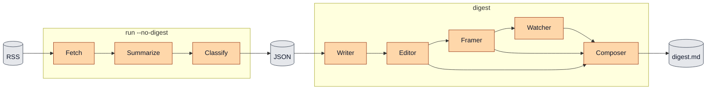

# Digest Generator

[](https://www.python.org/downloads/)
[](https://pytorch.org/)
[](https://developer.nvidia.com/cuda-toolkit-archive)
[](./LICENSE.md)

## Overview

Digest Generator is a Python pipeline that aggregates articles from RSS feeds you define, generates fact-dense per-article summaries via an LLM, classifies them with zero-shot NLI, and produces a Markdown digest via Ollama. Feeds, sections, and prompts are all user-supplied; the tool ships generic baselines so it runs on any topic out of the box.

## How It Works



`digest-generator run` does both halves end to end, writing the JSON corpus and the final Markdown digest into the same run directory. You can also run the halves separately: `run --no-digest` stops after building the corpus, and `digest <run_dir>` turns an existing corpus into a digest.

For full usage details, see [`docs/usage.md`](docs/usage.md).

## Installation

```bash
pip install digest-generator          # or: uv tool install digest-generator
digest-generator init                 # write a starter feeds.yaml
# edit ~/.config/digest-generator/feeds.yaml to add your categories and feeds
```

`init` creates `~/.config/digest-generator/feeds.yaml` from a starter template. Edit it to define your own sections (`categories:`) and the feeds in each, then run `digest-generator feeds` to check it. The digest stages need a running [Ollama](https://ollama.com); the topic classifier downloads a public model on first use.

Working from a clone instead (for development or audio/GPU extras):

```bash
git clone https://github.com/laplacef/digest-generator.git
cd digest-generator
uv sync --extra dev
```

### Configuration

Every setting has a sensible default, so most setups need no environment variables. Override via the environment or a `.env` file in the working directory. The common ones:

| Variable | Purpose | Default |
|---|---|---|
| `OLLAMA_HOST` | Ollama endpoint | `http://localhost:11434` |
| `OLLAMA_API_KEY` | Set to use cloud Ollama instead of local | unset (local) |
| `HF_TOKEN` | HuggingFace token, only for gated/private models | unset |
| `DIGEST_CONFIG` | Config directory holding `feeds.yaml` (and optional `prompts/`) | discovery |
| `PROMPTS_DIR` | Directory of prompt-template overrides | bundled baselines |

Every field in `digest_generator/shared/settings.py` maps to an uppercase env var. Full setup (prerequisites, optional audio rendering, optional GPU acceleration) is in [`docs/setup.md`](docs/setup.md).

## Usage

```bash
digest-generator init                 # write a starter feeds.yaml
digest-generator run                  # full pipeline (fetch + summarize + classify + digest)
digest-generator run --no-digest      # corpus build only (skip digest generation)
digest-generator run --audio          # full pipeline + Piper TTS rendition
digest-generator digest <run_dir>     # regenerate the digest from an existing run directory
digest-generator audio <run_dir>      # render audio for an existing digest (no LLM cost)
digest-generator feeds                # list available feeds
```

Each run lands in its own timestamped directory under `output/`, containing the per-stage caches, the final Markdown digest, run metadata, and a log of the run. See [`docs/usage.md`](docs/usage.md) for the full CLI reference, programmatic API, and output layout.

## Contributing

Bug reports, feature requests, and pull requests are all welcome. See [CONTRIBUTING.md](./CONTRIBUTING.md) for development setup, coding standards, and the contribution workflow.

This project follows a [Code of Conduct](./CODE_OF_CONDUCT.md). By participating, you are expected to uphold it.

## License

This project is licensed under the [Apache License 2.0](./LICENSE.md). You are free to use, modify, and distribute this project, provided you include proper attribution. See the [NOTICE](./NOTICE.md) file for details.
