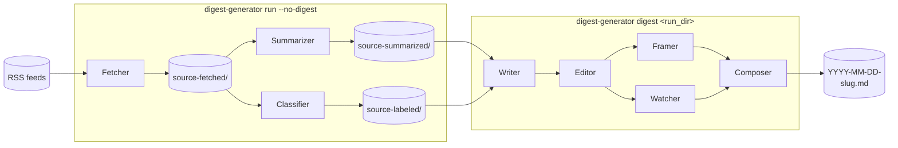

# Usage

This guide covers the command-line interface, the programmatic API, and the output layout.

## How It Works



`digest-generator run` does both halves end to end, writing the per-stage caches and the final Markdown digest into one run directory. You can also run the halves separately: `run --no-digest` builds the corpus and stops, and `digest <run_dir>` turns an existing corpus into a digest. Each stage caches its output in the run directory, so re-running skips work that is already done. Delete a stage's cache file to force it to rerun.

## CLI

After installing with `uv sync --extra dev`, the `digest-generator` command is available:

```bash
digest-generator --help
```

### Feed configuration

The tool ships with no feeds; you supply them in a `feeds.yaml`. Copy [`feeds.example.yaml`](../feeds.example.yaml) to one of the discovered locations and edit it. Every command that touches feeds (`run`, `fetch`, `feeds`) resolves the file in this order:

1. `--feeds <file>` (or the `FEEDS_FILE` env var)
2. `<config-dir>/feeds.yaml`, where the config dir comes from `--config` (or `DIGEST_CONFIG`)
3. `./digest-generator/feeds.yaml` (project-local)
4. `~/.config/digest-generator/feeds.yaml` (user-level)

The file defines your own `categories:` (the digest sections, each an `id` + `title`, in section order) and a `feeds:` list where each feed's `category` matches one of those ids. Categories are user-defined, so the section taxonomy is whatever you put in the file. A missing or invalid file produces an actionable error pointing back at the example.

### `run`: Full Pipeline

Fetch articles, generate summaries, classify topics, and produce a digest.

```bash
# Default: all feeds, 7 days back, with digest
digest-generator run

# AI feeds only, 1 day back, skip the digest
digest-generator run -c ai -d 1 --no-digest

# Build the corpus, then generate the digest separately
digest-generator run -c ai --no-digest
digest-generator digest output/2026-03-15-143022-a3f1

# Specific feeds by name
digest-generator run -f openai-blog -f github-blog

# Date range instead of days back
digest-generator run --since 2026-03-01 --until 2026-03-15 -c ai
```

| Option | Short | Description | Default |
|--------|-------|-------------|---------|
| `--days` | `-d` | Days back to fetch | `DAYS_BACK` env / 7 |
| `--since` | | Start date, YYYY-MM-DD (mutually exclusive with `--days`) | none |
| `--until` | | End date inclusive, YYYY-MM-DD (mutually exclusive with `--days`) | now |
| `--limit` | `-l` | Max entries per feed | none (all) |
| `--content-type` | `-c` | Filter by content type (repeatable) | all |
| `--feed` | `-f` | Filter by feed name (repeatable) | all |
| `--feeds` | | Path to a `feeds.yaml` file (overrides discovery) | `FEEDS_FILE` env / discovery |
| `--config` | | Config directory holding `feeds.yaml` | `DIGEST_CONFIG` env / discovery |
| `--output-dir` | `-o` | Override output directory | `OUTPUT_DIR` env / `output` |
| `--device` | | Compute device (`cpu`, `cuda`, `mps`) | `DEVICE` env / `cpu` |
| `--no-digest` | | Skip digest generation | false |
| `--audio` | | Render the digest to an Opus audio file after generation (requires the digest stage; rejects `--no-digest`) | false |

Digest model and sampling overrides are not available on `run`. Use `digest-generator digest <run_dir>` instead; it regenerates from the cached corpus without re-running the summarizer.

### `fetch`: Fetch Articles Only

Fetch articles for the selected feeds and print the new `run_dir` path on stdout. The other per-stage commands take that path as their argument, so the four can be chained in a shell:

```bash
RUN_DIR=$(digest-generator fetch -c ai)
digest-generator summarize "$RUN_DIR"
digest-generator label "$RUN_DIR"
digest-generator digest "$RUN_DIR"
```

`summarize` and `label` are independent: run them in either order, or in parallel from separate shells against the same `run_dir`. They accept the same filter flags as `run` (`--days` / `--since` / `--until` / `--limit` / `--content-type` / `--feed` / `--output-dir`); there is no `--device`, since the classifier doesn't run here.

### `summarize <run_dir>`: Summarize Fetched Articles

Reads `<run_dir>/source-fetched/`, runs the summarizer per feed (concurrency capped by `SUMMARIZER_CONCURRENCY`), and writes `<run_dir>/source-summarized/`. Skips feeds whose summary already exists; delete the file to force a rerun. Takes no flags beyond the positional `<run_dir>`.

### `label <run_dir>`: Classify Fetched Articles

Reads `<run_dir>/source-fetched/`, runs the BART-MNLI classifier per feed, and writes `<run_dir>/source-labeled/`. Skips feeds whose labels already exist. Accepts `--device` (`cpu` / `cuda` / `mps`) to override the compute device.

### `digest <run_dir>`: Generate a Digest

Generate a digest from a previous run's summaries. Each digest stage caches its output, so re-running skips completed stages; delete a stage's cache file to force a rerun.

```bash
# Re-run with the defaults from settings
digest-generator digest output/2026-03-15-143022-a3f1

# Override one or more stage models
digest-generator digest output/2026-03-15-143022-a3f1 \
    --writer-model llama3.2 \
    --editorial-model gpt-oss:120b-cloud

# Reproducible run: seed every stage with the same RNG state
digest-generator digest output/2026-03-15-143022-a3f1 --seed 42
```

| Argument/Option | Description | Default |
|-----------------|-------------|---------|
| `RUN_DIR` | Path to run directory (positional) | required |
| `--writer-model` | Override the section-writer model | `WRITER_MODEL` env |
| `--editorial-model` | Override the editorial-pass model | `EDITORIAL_MODEL` env |
| `--framer-model` | Override the title + intro model | `FRAMER_MODEL` env, falls back to writer model |
| `--watcher-model` | Override the what-to-watch model | `WATCHER_MODEL` env, falls back to writer model |
| `--seed` | Global RNG seed, applied to any stage without a per-stage seed | none |
| `--audio` | Render the digest to an Opus audio file after generation | false |

**Sampling overrides.** Each stage exposes three knobs (`top_p`, `repetition_penalty`, `seed`) on top of temperature. Per-stage CLI flags shadow the matching `<STAGE>_*` env vars; both default to unset, so Ollama uses its own defaults unless overridden.

| Stage | top_p | repetition_penalty | seed |
|-------|-------|--------------------|------|
| Writer | `--writer-top-p` | `--writer-repetition-penalty` | `--writer-seed` |
| Editorial | `--editorial-top-p` | `--editorial-repetition-penalty` | `--editorial-seed` |
| Framer | `--framer-top-p` | `--framer-repetition-penalty` | `--framer-seed` |
| Watcher | `--watcher-top-p` | `--watcher-repetition-penalty` | `--watcher-seed` |

### `audio <run_dir>`: Render Digest Audio

> First-time setup (install Piper + ffmpeg, configure audio env vars) is in [`setup.md`](./setup.md) under "Optional: Audio rendering". The reference below assumes those steps are done.

Render the digest at `<run_dir>` to a Piper-narrated Opus file. This is the way to iterate on narration without re-running the LLM stages; it has no LLM cost. The `.opus` file lands at `<run_dir>/audio/{date}-{slug}.opus`, matching the digest filename. Re-running against the same markdown, voice, and bitrate is a no-op. Voice files come from the public `rhasspy/piper-voices` repo on first use, so no token is needed.

```bash
# Render audio for an existing digest
digest-generator audio output/2026-03-15-143022-a3f1

# Override the bitrate (default 24 kbps)
digest-generator audio output/2026-03-15-143022-a3f1 --bitrate-kbps 32
```

The `.opus` path is printed on stdout. The command exits non-zero if the run directory is missing, has no digest `.md` at its root, or the render fails.

| Argument/Option | Description | Default |
|-----------------|-------------|---------|
| `RUN_DIR` | Path to the run directory containing the digest `.md` (positional) | required |
| `--bitrate-kbps` | Override the configured Opus bitrate | `AUDIO_BITRATE_KBPS` env / 24 |

`run --audio` and `digest --audio` chain this step automatically after a successful digest. With `run --audio`, an audio failure is logged but does not fail the run, since the digest is the primary output. Standalone `audio` and `digest --audio` exit non-zero on failure, since audio is what was explicitly requested.

### `feeds`: List Configured Feeds

Lists the feeds resolved from your `feeds.yaml`, grouped by content type.

```bash
# All feeds, grouped by content type
digest-generator feeds

# Only security feeds
digest-generator feeds -c security

# From a specific feeds file
digest-generator feeds --feeds path/to/feeds.yaml
```

| Option | Short | Description | Default |
|--------|-------|-------------|---------|
| `--content-type` | `-c` | Filter by content type (repeatable) | all |
| `--feeds` | | Path to a `feeds.yaml` file (overrides discovery) | `FEEDS_FILE` env / discovery |
| `--config` | | Config directory holding `feeds.yaml` | `DIGEST_CONFIG` env / discovery |

Content types are the category ids defined in your `feeds.yaml`.

## Programmatic API

The CLI is a thin adapter over `digest_generator.api`. The main entry points:

- `fetch`, `summarize`, `label`: async per-stage primitives with cache-skip and resume.
- `digest`: reads the corpus, runs the digest pipeline, and returns the result.
- `run`: runs fetch, then summarize and label, then an optional digest.

Plus `resolve_feeds` and `list_feeds` helpers. Creating the run directory and wiring up logging and telemetry is the caller's responsibility; `digest_generator.cli` handles it for command-line use.

### Full pipeline

```python
from pathlib import Path
from digest_generator.api import resolve_feeds, run
from digest_generator.core.types import Filter

feeds = resolve_feeds(content_types=["ai"])
filter = Filter.resolve(days_back=3)
run_dir = Path("output/myrun")
run_dir.mkdir(parents=True, exist_ok=True)

run(feeds, filter, run_dir=run_dir, with_digest=True)   # with_digest=False stops at the corpus
```

### Per-stage invocation

Each primitive is independently callable, which is useful for partial reruns or experiments.

```python
import asyncio
from digest_generator.api import fetch, summarize, label, digest

asyncio.run(fetch(feeds, filter, run_dir=run_dir))
asyncio.run(summarize(run_dir=run_dir))
asyncio.run(label(run_dir=run_dir))

result = digest(run_dir=run_dir)
```

### Filtered feeds

```python
from datetime import UTC, datetime
from digest_generator.api import resolve_feeds
from digest_generator.core.types import Filter

feeds = resolve_feeds(content_types=["ai", "security"])   # by content type
feeds = resolve_feeds(feed_names=["openai-news", "github-blog"])   # by name

filter = Filter.resolve(
    since=datetime(2026, 3, 1, tzinfo=UTC),
    until=datetime(2026, 3, 15, tzinfo=UTC),
)
filter = Filter.resolve(days_back=7, limit=5)   # with a per-feed entry limit
```

### Standalone digest

```python
from pathlib import Path
from digest_generator.api import digest

result = digest(run_dir=Path("output/2026-03-15-143022-a3f1"))

# Override individual stage models
result = digest(
    run_dir=Path("output/2026-03-15-143022-a3f1"),
    writer_model="llama3.2",
    editorial_model="gpt-oss:120b-cloud",
)
```

`digest` returns `None` when `<run_dir>/source-summarized/` is empty. For finer control, each stage also accepts a `SamplingConfig` (from `digest_generator.shared.llm.sampling`) covering `temperature`, `top_p`, `repetition_penalty`, and `seed`.

## Run Directory Layout

Every run lands in `output/<run_id>/`, where `<run_id>` is `YYYY-MM-DD-HHmmss-xxxx` (a UTC timestamp plus a 4-character suffix for uniqueness). Typical contents:

```
output/2026-03-15-143022-a3f1/
├── source-fetched/<feed>.json       # raw fetched articles, per feed
├── source-summarized/<feed>.json    # per-article summaries, per feed
├── source-labeled/<feed>.json       # topic labels, per feed
├── section-drafts/<section>.md      # writer-stage cache, one per content type
├── section-edits/<section>.md       # editorial-stage cache
├── assembly/clusters.json           # story-clustering cache
├── assembly/framing.json            # title + intro cache
├── assembly/watch.json              # what-to-watch cache
├── audio/<date>-<slug>.opus         # rendered audio (only when --audio is used)
├── audio/cache_key.txt              # audio render cache key
├── meta.json                        # run metadata (timestamps, counts, models)
├── <date>-<slug>.md                 # the final digest
└── run.log                          # self-contained log for this run
```

Re-running the pipeline on the same directory skips any stage whose output already exists. Delete a specific cache file to force that stage to rerun. The `source-summarized/` and `source-labeled/` files are the inputs to `digest-generator digest`.

## Digest Output

The final digest is assembled in a fixed structure:

```
# <title>

## Overview

<lede paragraph, also stored as the `summary` frontmatter field>

## <Section 1>
...section prose, with inline links to each article it cites...

## <Section N>
...

## What to Watch

### <Watch item 1>
...
```

Section headings are plain text. The `## What to Watch` block is the only forward-looking part; the section bodies report what happened, not what comes next. Frontmatter fields, in order: `title`, `date`, `reading_time`, `article_count`, `summary`, `sections`.

## Configuration

All settings are read from environment variables or a `.env` file. See `digest_generator/shared/settings.py` for the full list. CLI flags override env vars for the duration of a command.

Per-stage sampling can also be set through env vars: `WRITER_TOP_P`, `WRITER_REPETITION_PENALTY`, `WRITER_SEED`, and the same triplet for `EDITORIAL_*`, `FRAMER_*`, `WATCHER_*`, and `CLUSTERER_*`. All default to unset, so Ollama's defaults apply unless overridden. The clusterer stage is configured through env vars only (`CLUSTERER_MODEL`, `CLUSTERER_TEMPERATURE`, and so on); it has no CLI flags.
